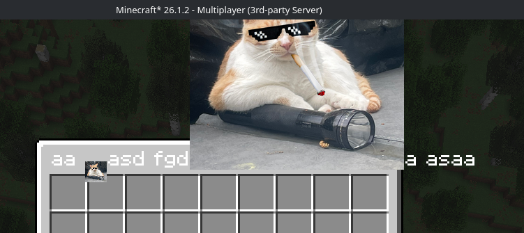
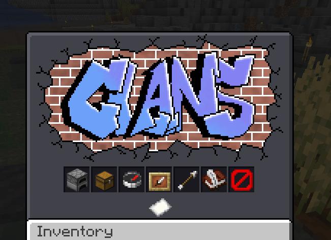
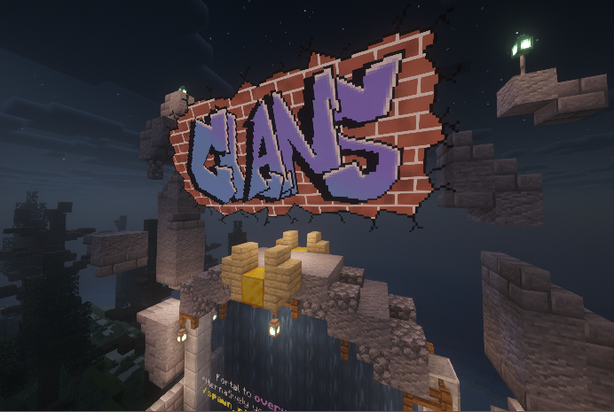
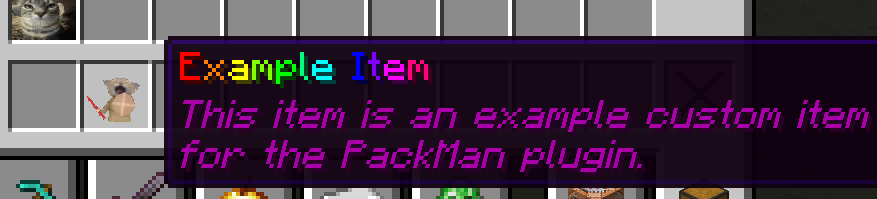

# packman


Packman (resource PACK MANager) is a plugin (and library) that manages a custom resource pack and custom items.

It allows server owners to add simple items, glyphs, etc to the game.

It allows plugin developers to write plugins that can add their own textures, items and glyphs into the game.

### Features
 - Custom glyphs (GUI textures, emojis, etc) (see [example_pack/glyphs](example_pack/glyphs) and [Custom Glyphs](#custom-glyphs))
 - Custom items (texture, name, lore, etc) (see [example_pack/items](example_pack/items) and [Custom Items](#custom-items))


- `/packman glyph list [<page>]` to list and preview all glyphs.
 - `/packman give <player> <pack> <item> [<amount>]` (with autocomplete) to give a custom item to a player.
 - `/packman reload` command that re-generates the resource pack and re-sends it to every player on the server.
 - Plugins can register their own packman packs in `onEnable()`.
 - Generates a Minecraft resource pack that is all of your packman packs combined.
 - Very simple yml pack format. (see [example_pack](example_pack) for an example of how to add & customise custom items)
 - Hosts the resource pack on a HTTPServer in another thread, so it doesn't need to upload to elsewhere on the internet.
 - Tells players' client to download the resource pack on join.

## How To

### Adding the plugin to your server

 You **MUST** open a port on your server for this to work, the port can be changed in `config.yml`

After adding the plugin jar to your servers' `plugins/` folder and running it once, it will create a `packman/config.yml` file. Please look through this and make the necessary changes (setting your server's public facing address and port)

### Creating a Pack

see [example_pack](example_pack) for reference.

A packman pack is our very simple custom resource pack format, it allows you to easily add custom resources into your Minecraft server by editing yml files. 

1. Create a new folder with the name of your new pack.
2. Inside the folder you must create a packman.yml file, example:

```yaml
name: "example_pack"
description: |
  Example pack for Packman
version: "0.1"
```

3. You are now done creating an empty packman pack.
4. You can add it to your server by copying it into `plugins/packman/packs`.

### Custom Glyphs

see [example_pack/glyphs](example_pack/glyphs) for reference.

With a custom glyph you are able to render custom images in chest GUI titles, chat (emojis), or anywhere you can use PlaceholderAPI.

1. Create a new folder inside your pack called `glyphs`.
2. Create a new yml file in your `glyphs` folder called `glyphs.yml`
3. Add glyphs to the `glyphs.yml` like so:
```yaml
glyphs:
  - name: "example_glyph"
    texture: "example_glyph.png" # You need this file to also be in the glyphs folder
    height: 100 # scale
    ascent: 98 # vertical offset
  - name: "example_glyph_small"
    texture: "example_glyph.png"
    height: 10 # scale
    ascent: 2 # vertical offset
```
4. Add your pack to the server as detailed in [Creating a Pack](#creating-a-pack).
5. Use your new glyph:
  - You can use your new glyph in chest GUI titles to create custom inventories with `[pmglyph:<YOUR_PACK_NAME>:<YOUR_GLYPH_NAME>]` and `[pmshift:<SHIFT_AMOUNT>]` inside of chest GUIs, this should be compatible with any plugins' GUI. examples:

```
aa [pmglyph:example_pack:example_glyph_small]asd fgd[pmglyph:example_pack:example_glyph]a asaa
[pmshift:-48][pmglyph:clans_pack:main_menu]
```




  - You can also use your glyph anywhere you can use placeholderAPI if you have it installed using `%pm_glyph:<YOUR_PACK_NAME>:<YOUR_GLYPH_NAME>%` and `%pm_shift:<SHIFT_AMOUNT>%`.

```
%pm_glyph:clans_pack:clans_logo%
```
<div style="text-align: center;"></div>

### Custom Items

see [example_pack/items](example_pack/items) for reference.

With a custom item you are able to add simple items to the game.

1. Create a new folder inside your pack called `items`.
2. Create a new yml file in your `items` folder called `items.yml`
3. Add items to the `items.yml` like so:
```yaml
items:
  - name: "example_item"
    display_name: "<rainbow>Example Item</rainbow>"
    lore: |
      This item is an example custom item
      for the PackMan plugin.
    base_material: "FEATHER" # The material beneath the custom item
    texture: "example_item.png"
```
<div style="text-align: center;"></div>

4. Add your pack to the server as detailed in [Creating a Pack](#creating-a-pack).
5. Give yourself a custom item using the in-game command: `/packman give <player_name> <pack_name> <item_name>`, it will allow you to tab complete all arguments, so you won't need to remember every pack name and item name you have installed.

## How To (Plugin Dev)

### Including the repo

Add the repo via gradle like so:

```kt
repositories {
    maven("https://api.modrinth.com/maven")
}

dependencies {
    compileOnly("maven.modrinth:packman:0.1")
}
```

### Using Packman as a library

You must declare your pack in your plugins `onEnable()` func. Here is how you would add your own pack from your plugin's resources

```java
public void onEnable() {
	if (Bukkit.getPluginManager().getPlugin("Packman") == null) {
		getLogger.warning("Could not find Packman plugin, it will not be used."); // Error here if packman is not optional
	} else {
		saveResource("pack_name.zip"); // Take the pack zip out of resources
		Packman.setPack("pack_name", new File(getDataFolder(), "pack_name.zip")); // Tell packman about your pack
	}
}
```

It's as easy as that!

Now you can use different `Packman.` functions from inside your plugin to get glyphs, custom items (as ItemStack), and much more!

Here are some functions packman provides:

```java
/**
 * Sets the pack, so if already exists then it'll update, you can call this from your own plugin to add packs from your plugins' folder (preferably in `onEnable`)
 * @param packName The name of the new pack that you will add.
 * @param pathToPack The path to the pack.
 */
static public void setPack(String packName, File pathToPack) {}

/**
 * Gets the character that represents a glyph in a packman pack.
 * <p>You can then use this character anywhere and the client will render it as the custom glyph,
 * this is used for custom chest GUIs, emojis, etc</p>
 *
 * @param packName The name of the pack you want to get a glyph from
 * @param glyphName The name of the glyph you want to get
 * @return The resulting glyph, will be null if no pack/glyph match is found!
 */
static public Character getGlyphFromPack(String packName, String glyphName) {}

/**
 * Generates a sequence of glyphs that will cause whatever text follows it to be shifted right/left by a specified amount
 * <p>This is helpful for aligning chest GUIs</p>
 *
 * @param shift How much should this string shift the text? positive = right, negative = left
 * @return The string of glyphs that will cause text to be shifted.
 */
static public String getShiftGlyphString(int shift) {}

/**
 * Gets a custom item from the pack and returns it as an item stack
 * <p>This allows you to gift players custom items, or show it in chest GUIs</p>
 *
 * @param packName The name of the pack you want to get an item from
 * @param itemName The name of the item you want to get
 * @return The custom item as an ItemStack
 */
static public ItemStack getCustomItemStack(String packName, String itemName) {}
```
